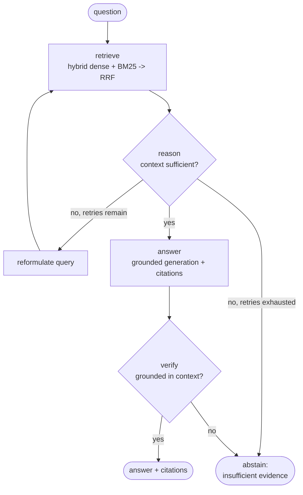

# agentic-rag-evals

A reference implementation of evaluation-driven agentic RAG - a small, real retrieval-augmented
generation service where every change is gated by
an offline evaluation suite that runs on every pull request.

[](https://github.com/mikitadaroshkin/agentic-rag-evals/actions/workflows/ci.yml)
[](LICENSE)
[](pyproject.toml)

## What this is

A compact, end-to-end RAG system over a small public corpus (information-retrieval / ML concept
articles from Wikipedia). It is deliberately scoped as a reference implementation - the point is
not corpus size, it is to show the *method* I bring to LLM systems in real code you can clone and run:

- Agentic orchestration with LangGraph - a real state graph with conditional retry and an
  abstention guardrail, not a linear `retrieve -> prompt -> generate` script.
- Hybrid retrieval - dense embeddings + BM25 fused with Reciprocal Rank Fusion.
- Evaluation as the primary artifact - a golden set, deterministic retrieval metrics, an
  LLM-as-judge for answer quality, and a CI gate that fails the build on regression.
- Observability and serving - OpenTelemetry spans around every node, a FastAPI endpoint, and a
  container that builds and starts ready to answer.

It runs fully locally with no API key (local `sentence-transformers` embeddings + a deterministic
offline model), so anyone can reproduce it for free.

## Architecture



The graph is agentic: from a real retrieval-confidence signal and an LLM sufficiency check,
`reason` decides whether to answer now, rewrite the query and retry (bounded), or - once retries
are exhausted and the context is still too weak - abstain instead of guessing. After generation,
`verify` independently checks the answer is grounded in the retrieved context and falls back to the
same abstention rather than letting an unsupported answer through.

## Results

Real numbers from a run over the golden set (`python -m evals.run_eval`), reproduced bit-for-bit in
CI from recorded fixtures. Full report: [`evals/reports/latest.json`](evals/reports/latest.json).

| Metric | Score | What it measures |
|---|---|---|
| hit@5 | 1.00 | a gold supporting doc appears in the top-5 retrieved |
| recall@5 | 0.98 | fraction of gold supporting docs retrieved |
| MRR | 0.98 | rank of the first gold supporting doc |
| answer similarity | 0.76 | cosine(answer, reference) in embedding space - deterministic |
| answer correctness | 0.67 | LLM-as-judge vs. gold reference answers (0-1) |
| faithfulness | 0.73 | answers free of claims unsupported by the context |
| abstention accuracy | 1.00 | correctly abstains on the out-of-corpus controls |

- Corpus: 190 chunks across 15 documents. Golden set: 30 answerable + 3 out-of-corpus controls.
- Generation + judge: Qwen2.5-1.5B-Instruct, run locally on CPU. Embeddings: all-MiniLM-L6-v2
  (local), k = 5.

Retrieval and answer-similarity are deterministic; correctness and faithfulness are LLM-judged. The
generator is a small local model, chosen so the entire suite reproduces with no API key and no cost
- the numbers are honest for that model, and the repo's value is the method: point `.env` at a
stronger model and re-baseline with `make eval-record`. See [How the evals work](#how-the-evals-work).

## Quickstart

```bash
# 1. Install (creates a venv, installs CPU torch + deps)
make setup && source .venv/bin/activate

# 2. Build the vector index from the bundled corpus
make ingest

# 3. Ask a question (runs fully locally, no API key required)
python -m uvicorn agentic_rag.api:app --port 8000 &
curl -s localhost:8000/query -H 'content-type: application/json' \
  -d '{"question": "What is BM25 and why is it used in retrieval?"}' | python -m json.tool

# 4. Run the evaluation suite
make eval
```

To use a hosted model for generation and the LLM-as-judge, copy `.env.example` to `.env` and set
`OPENAI_API_KEY` (any OpenAI-compatible endpoint works via `OPENAI_BASE_URL` - OpenAI, Ollama, vLLM).

With Docker:

```bash
docker compose up --build   # serves on :8000 with the index baked into the image
```

## How the evals work

The evaluation harness lives in [`evals/`](evals/).

- Golden set ([`golden.jsonl`](evals/golden.jsonl)) - 30 authored Q/A grounded in the corpus, each
  labelled with its supporting documents, plus 3 out-of-corpus questions that *should* be refused.
- Retrieval metrics ([`metrics.py`](evals/metrics.py)) - hit@k, recall@k, MRR against the gold
  supporting docs. Fully deterministic, no model calls.
- LLM-as-judge ([`judge.py`](evals/judge.py)) - grades each answer against its reference on
  correctness and faithfulness with a structured rubric.
- The CI gate - [`.github/workflows/ci.yml`](.github/workflows/ci.yml) runs lint, tests, and the
  eval suite on every PR, and fails the build if any metric drops below its floor
  ([`thresholds.json`](evals/thresholds.json)).

CI runs the evals without an API key and for free: every model call is served from committed
cassettes (recorded request/response fixtures), so judged scores reproduce deterministically while
retrieval metrics are computed live on local embeddings. Changing a prompt, the corpus, or the model
invalidates the cassettes on purpose - you re-baseline with `make eval-record` (which calls the
configured model, local or hosted), and the eval numbers get re-reviewed. That is the whole point:
you cannot quietly change model behaviour without the evals noticing.

## Design notes

- Why eval-driven. LLM systems regress silently - a prompt tweak or model bump changes behaviour
  with no stack trace. An offline golden-set eval wired into CI turns "vibes" into a gate, which is how
  I ship LLM features with confidence.
- Why hybrid + RRF. Dense retrieval captures paraphrase; BM25 anchors on exact terms and rare
  tokens. Reciprocal Rank Fusion combines their rankings without needing to calibrate incomparable
  score scales.
- Why abstain. A grounded system that says "I don't know" is worth more than a fluent one that
  invents citations. The `verify` node makes abstention a first-class outcome and the out-of-corpus
  controls measure it.
- Cassettes over live CI calls. Gating every PR on live model calls is slow, costly, and flaky.
  Recording fixtures keeps CI free and deterministic while the reported numbers still come from a real
  model run.
- What I'd add for production. pgvector (or a managed vector DB) behind the same retriever
  interface; a cross-encoder reranker; per-query cost/latency budgets in the graph; online eval on
  sampled production traffic feeding back into the golden set; and a richer guardrail policy layer.

## Corpus provenance

The corpus is a snapshot of English Wikipedia extracts (CC BY-SA 4.0) on IR/ML topics; provenance,
attribution, and the refresh script are in [`data/README.md`](data/README.md). No client, proprietary,
or personal data appears anywhere in this repository.

## Project layout

```
src/agentic_rag/    graph, nodes, hybrid retrieval, embeddings, LLM provider, tracing, FastAPI
data/               corpus snapshot + fetch script
evals/              golden set, retrieval metrics, LLM-as-judge, runner, thresholds, cassettes
tests/              unit + smoke tests (run offline)
.github/workflows/  CI: lint + tests + eval gate
```

## License

[MIT](LICENSE) (c) 2026 Mikita Daroshkin
